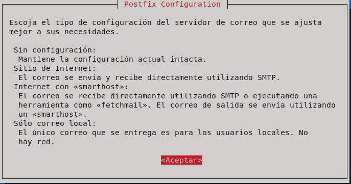
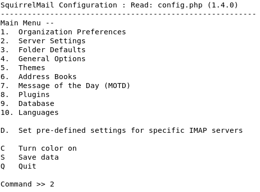
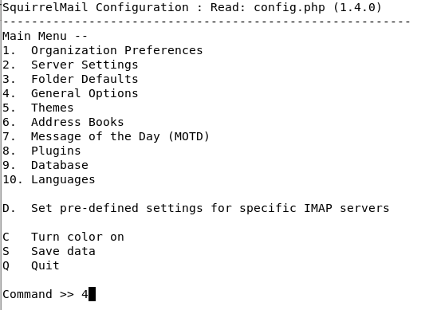
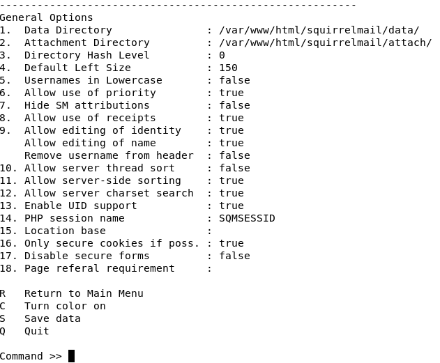

# Setup

## Default Emails

| User       | Domain             |
| ---------- | ------------------ |
| aplicacion | matriz.autoupb.com |
| admin      | matriz.autoupb.com |
| gerente    | matriz.autoupb.com |
| inventario | matriz.autoupb.com |
| rh         | matriz.autoupb.com |
| ventas     | matriz.autoupb.com |

## Production

### Setup API

1. Install Go > 1.18.
2. Compile:

```shell
go build -buildvcs=false -ldflags="-s -w" -trimpath -mod vendor -o ./api.exe ./cmd/api
```

3. Set environment variables

| Variable name | Description                                             | Example value                           |
| ------------- | ------------------------------------------------------- | --------------------------------------- |
| API-KEY       | API Key to be used by the clients connecting to the API | API_KEY_TO_BE_USED_BY_CLIENTS           |
| DB-URL        | Database URL to connect to                              | root:password@tcp(127.0.0.1)/upb_motors |
| HOST          | Listen address                                          | 127.0.0.1:8080                          |

4. Execute the binary

```shell
./api.exe
```

### Build Web catalog

1. Install Go > 1.18.
2. Compile:

```shell
go build -buildvcs=false -ldflags="-s -w" -trimpath -mod vendor -o ./web.exe ./cmd/web
```

3. Set environment variables

| Variable name | Description                                             | Example value                           |
| ------------- | ------------------------------------------------------- | --------------------------------------- |
| API-KEY       | API Key to be used by the clients connecting to the API | API_KEY_TO_BE_USED_BY_CLIENTS           |
| DB-URL        | Database URL to connect to                              | root:password@tcp(127.0.0.1)/upb_motors |
| HOST          | Listen address                                          | 127.0.0.1:8080                          |

4. Execute the binary

```shell
./web.exe
```

### FTP(S)

Using Windows server.

1. Add roles and features


2. Installation Type `Role-bases`


3. Web server (IIS)


4. Disable all and enable `FTP`


5. `Open Server Manager >Tools > Internet Information Services (IIS) Manager`


6. FTP Firewall support


7. Set configuration and apply


8. Add ports to firewall inbound rules


9. Create SSL certificate.

```powershell
New-SelfSignedCertificate -FriendlyName "selfsigned-upb-motors" -CertStoreLocation cert:\localmachine\my -DnsName www.matriz.autoupb.com
```


10. Serve folder in FTP


11. Serve folder in FTPS


### HTTP(S)

#### Setup container

Install docker in the operating system.

1. Update `config.json`:

2. Build the image:

```shell
docker build -t upb-motors:latest /path/to/repository
```

3. Create the container:

```shell
docker create -p 80:80 -p 443:443 --restart unless-stopped --name upb-motors-production upb-motors:latest
```

4. Start the container:

```shell
docker start upb-motors-production
```

### Primary DNS

#### Using Windows Server.

1. Add roles and features


2. Installation Type `Role-bases`


3. DNS server


4. Confirmation and install


4. `Open Server Manager >Tools > DNS`


5. Select server


6. New zone


7. Primary zone


8. Forward lookup zone


9. Zone name


10. Zone file


11. No Dynamic updates


12. New Reverse lookup zone


13. Ensure zone transfer is allowed (`Zone properties -> Zone tranfers`):


##### Services Domains

###### HTTP/HTTPS

1. New Host **A**


2. `www` name


###### FTP/FTPS

1. `ftp` name (A)


###### All mail services

1. `mail` host (A)


2. Mail exchange (MX)


### Secondary DNS

For each company, create a zone pointing to its domain and domain server. (Ensure that zone transfer is allowed in the primary server).

1. Create zone


2. Point to domain of company


### Mail

1. Access the file `sources.list`

```shell
sudo nano sources.list
```

2. comment the second line


3. update repositories

```shell
sudo apt update
```

4. install postfix

```shell
apt install postfix
```

5. Press accept in postfix configuration



6. Select website


7. Add a mail system name


8. restart postfix

```shell
sudo service postfix restart
```

9. Install dovecot

```shell
sudo apt install dovecot-imapd dovecot-pop3d
```

10. restart dovecot

```shell
sudo service dovecot restart
```

11. install PHP

```shell
sudo apt-get install php
```

12. install squirrelmail

```shell
wget https://sourceforge.net/projects/squirrelmail/files/stable/1.4.22/squirrelmail-webmail-1.4.22.zip
```

13. unzip the file

```shell
unzip squirrelmail-webmail-1.4.22.zip
```

14. Select file location

```shell
sudo mv squirrelmail-webmail-1.4.22 /var/www/html/
```

15. Change Directory Owner

```shell
sudo chown -R www-data:www-data /var/www/html/squirrelmail-webmail-1.4.22/
sudo chmod 755 -R /var/www/html/squirrelmail-webmail-1.4.22/
sudo mv /var/www/html/squirrelmail-webmail-1.4.22/ /var/www/html/squirrelmail
```

16. configure squirrelmail

```shell
sudo perl /var/www/html/squirrelmail/config/conf.pl
```

17. Select option 2 of "server settings"



18. Select option 1 of "domain"


19. Write the domain


20. Select option 4 of "general options"



21. Modify options 1,2 and 11



22. Enter the link `localhost/src/login.php`


## Development

### `php.ini`

```ini
extension = /path/to/php_openssl
extension = /path/to/php_pdo_mysql
file_uploads = On
upload_max_filesize = 100M
post_max_size = 100M
```

## Environment variables for php process

```ini
DB_HOST = HOST:PORT
DB_USERNAME = USERNAME
DB_PASSWORD = PASSWORD
DB_DATABASE = DATABASE
EMAIL_HOST = HOST
EMAIL_PORT = PORT
EMAIL_USERNAME = USERNAME
EMAIL_PASSWORD = PASSWORD
```