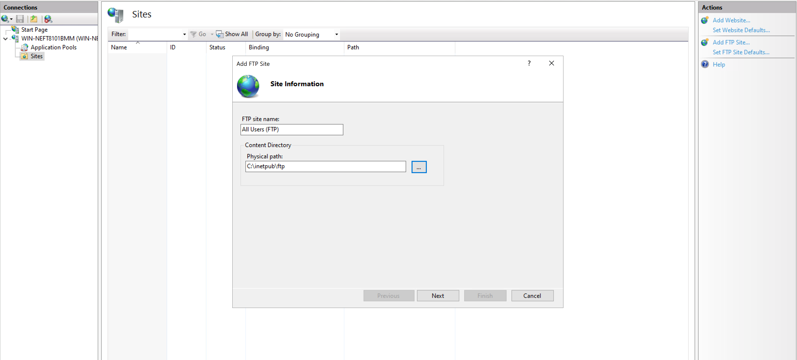
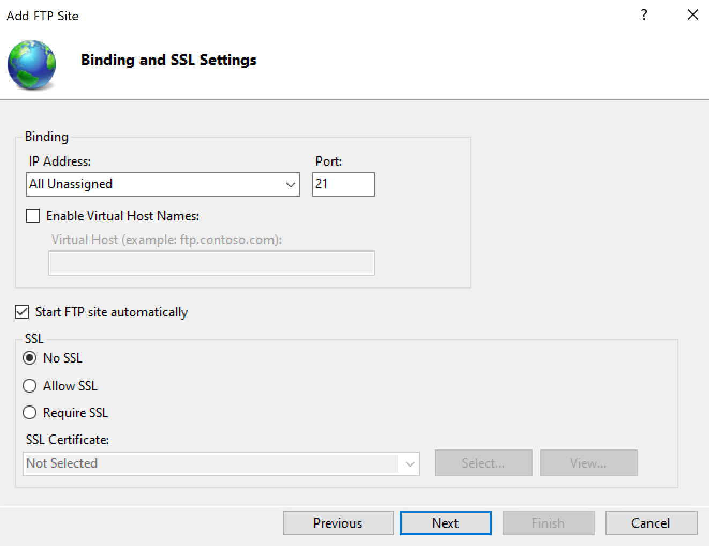
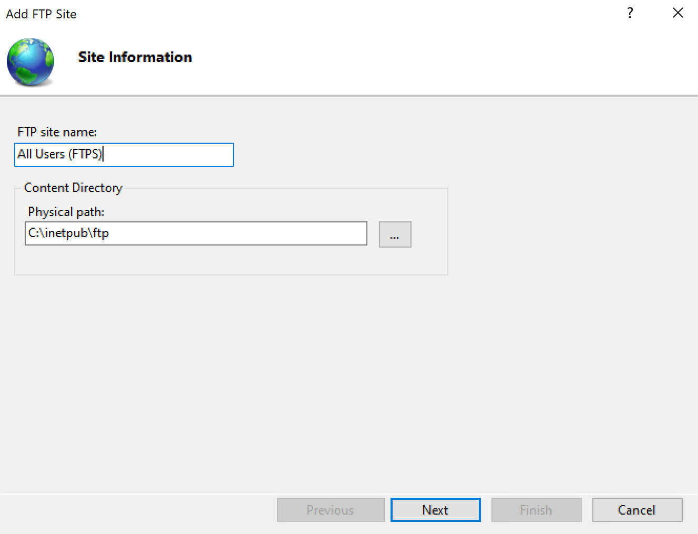
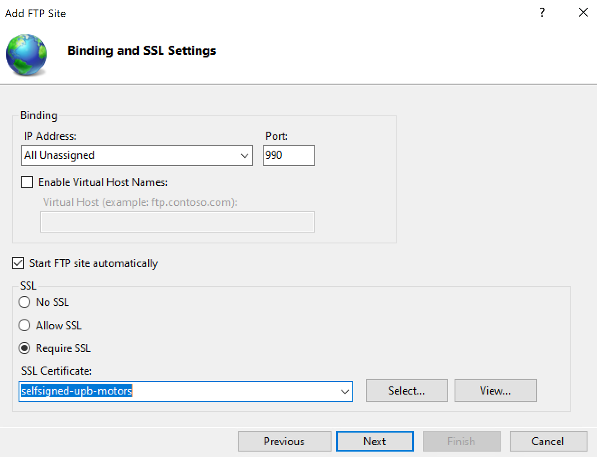
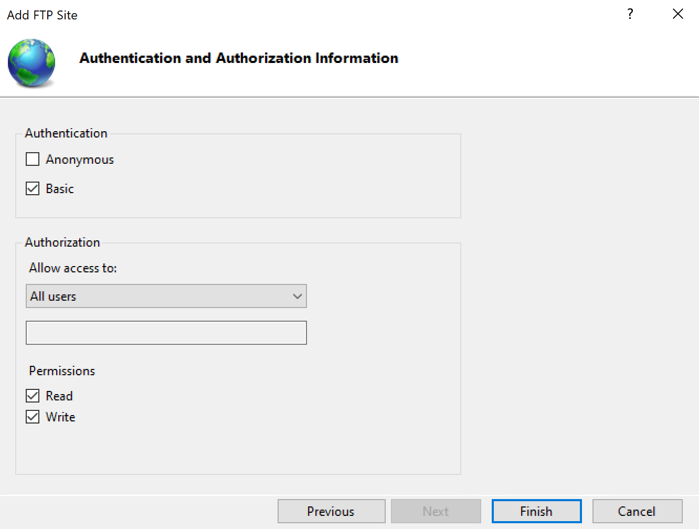

# Setup

## Default Emails

| User       | Domain        |
| ---------- | ------------- |
| aplicacion | upb-motors.co |
| admin      | upb-motors.co |
| gerente    | upb-motors.co |
| inventario | upb-motors.co |
| rh         | upb-motors.co |
| ventas     | upb-motors.co |

## Production

### FTP(S)

1. Add roles and features


2. Installation Type `Role-bases`


3. Web server (IIS)


4. Disable all and enable `FTP`


5. `Open Server Manager >Tools > Internet Information Services (IIS) Manager`


6. FTP Firewall support


7. Set configuration and apply


8. Add ports to firewall inbound rules


9. Create SSL certificate.

```powershell
New-SelfSignedCertificate -FriendlyName "selfsigned-upb-motors" -CertStoreLocation cert:\localmachine\my -DnsName upb-motors.com
```


10. Serve folder in FTP






11. Serve folder in FTPS







### HTTP(S)

#### Setup container

Install docker in the operating system.

1. Update `config.json`:

2. Build the image:

```shell
docker build -t upb-motors:latest /path/to/repository
```

3. Create the container:

```shell
docker create -p 80:80 -p 443:443 --restart unless-stopped --name upb-motors-production upb-motors:latest
```

4. Start the container:

```shell
docker start upb-motors-production
```

### Mail

1. Install `.NET framework 3.5 (includes .NET 2.0 and 3.0)` feature
2. Install `hMailServer`

## Development

### `php.ini`

```ini
extension = /path/to/php_openssl
extension = /path/to/php_pdo_mysql
file_uploads = On
upload_max_filesize = 100M
post_max_size = 100M
```

## Environment variables for php process

```ini
DB_HOST = HOST:PORT
DB_USERNAME = USERNAME
DB_PASSWORD = PASSWORD
DB_DATABASE = DATABASE
EMAIL_HOST = HOST
EMAIL_PORT = PORT
EMAIL_USERNAME = USERNAME
EMAIL_PASSWORD = PASSWORD
```

##DNS

```ini
Domain Name System, es una base de datos jerárqquica y distribuida que contiene asignaciones entre nombres de host
Los navegadores web interactúan mediante direcciones de Protocolo de Internet (IP).


DNS directo: Permite principalmente que una computadora, servidor, teléfono inteligente u otro cliente final traduzca un nombre de dominio o una dirección de correo electrónico a la dirección del dispositivo que manejaría la comunicación resultante.
La búsqueda DNS inversa es la determinación de un nombre de dominio que está asociado a una determinada dirección IP utilizando el DNS de internet.

Existen muchos registros DNS, nombrare algunos de los principales, y sus funciones:
Registro A: registro que contiene la dirección IP de un dominio.
Registro CNAME: reenvía un dominio o subdominio a otro dominio, NO proporciona una dirección IP.


AHORA CONFIGURAMOS EL DNS EN EL ROUTER
Activamos el servicio:

```


```ini
INFORMACIÓN


```


#DNS WINDOW SERVER
```ini
Configuración:
```